# 🚀 Lab 1: TypeScript Web Resources	

Time to complete: **~45 minutes**

Web Resources are files that are added to a Dataverse solution that can be used in various ways such a icons, command bar commands, and form scripts. Form Scripts add custom logic to Model Driven Forms. In this lab you will create a Model Driven App form script using TypeScript. TypeScript is a language that 'transpiles' to JavaScript and gives a number of advantages over plain JavaScript such as type safety and more advanced language features.

When writing TypeScript, usually the following is true:

1. You span your TypeScript across multiple source files that need to be compiled into a single JavaScript file
1. You import modules from `node_modules` that need to be also compiled into the single JavaScript file
1. Your JavaScript typically will include source maps to enable debugging during development, but should be minified (optimised in size) for production distribution.

Webpack is a tool that addresses each of these issues by taking the output from the TypeScript compiler (`tsc`), parses the files and bundles them along with any required node modules into a single JavaScript file that can be run inside the browser. 

## Babel vs TypeScript JavaScript Transpilation

`Webpack` can be used in conjunction with another library called `Babel`. In a similar way to the TypeScript compiler (`tsc`), Babel can take your TypeScript code and translate it into JavaScript (often referred to as transpiling) so that it will run inside the browser. You might use Babel if you needed more control over the final output such as adding polyfills, using features that the TypeScript compiler doesn’t support or provide multiple versions targeting different run-times. I find no need to use Babel for creating JavaScript Web resources. If you are using Babel then make sure you are using a loader that runs the TypeScript compiler to perform type checking since Babel on it’s own will simple convert to JavaScript without performing any checks.

Using the `ts-loader` webpack plugin will run the tsc compiler for you so that all your types are checked – but if you were using an alternative Babel loader, you can always run `tsc --noEmit` to run the TypeScript compiler and show errors, but not generate any output.

## ✅Task 1 - Project folder setup

**VS Code** TypeScript projects do not have a project file like C# (`.csproj`) – so you can simply create a new folder with the name of your project. 

1. Open **VS Code**.
1. If you do not see a **PowerShell** terminal, show the terminal using  ```Ctrl+` ```  (back tick). Create a new terminal if you need using ```Ctrl+Shift+` ```  .
1. At the PowerShell command line, type:

    ```
    mkdir c:\workshop\mda-client-hooks
    cd c:\workshop2\mda-client-hooks
    code . -r
    ```


> [!NOTE]
> Using `-r` will open the current directory and re-use the current VS Code instance.

4. **Npm** is used to install required modules into a node_modules folder. To intialise your project type the following at a PowerShell terminal. If you don't see a terminal, show the terminal using  ```Ctrl+` ```  (back tick)

   ```powershell
   npm init -y
   ```

6. TypeScript is used to initialize the project folder with a `tsconfig.json` file. At the command line, type:
   ```powershell
   npm install typescript --save-dev
   npx tsc -init
   ```
   
7. Open the `tsconfig.json` file and update to match the following:

    ```json
    {
    	"compilerOptions": {
    		"target": "ES2017",
    		"module": "commonjs",
    		"moduleResolution": "node",
    		"lib": [
    			"ES2017",
    			"dom"
    		],
    		"rootDir": "src",
    		"strict": true,
    		"alwaysStrict": true,
    		"strictFunctionTypes": true,
    		"strictNullChecks": true,
    		"strictPropertyInitialization": true,
    		"forceConsistentCasingInFileNames": true,
    		"noImplicitAny": true,
    		"noImplicitReturns": true,
    		"noImplicitThis": true,
    		"noFallthroughCasesInSwitch": true,
    		"noUnusedLocals": true,
    		"noUnusedParameters": true,
    		"emitDecoratorMetadata": false,
    		"experimentalDecorators": false,
    		"downlevelIteration": true,
    		"declaration": false,
    		"sourceMap": true,
    		"pretty": true,
    		"esModuleInterop": true,
        	"allowSyntheticDefaultImports": true,
            "typeRoots": ["node_modules/@types"]
    	}
    }
    ```

- **`module` -** This is important to set to es2017 so that webpack can ‘tree-shake’ and decide which modules it needs to output in the bundle.
- **`lib`** tells typescript that we can use the ES2017 features (e.g. Promise) and HTML Dom libraries because they will be available at runtime.
- **`rootDir`** – We are putting our TypeScript inside the `src` folder. This is a common convention and separates the TypeScript from other resources that we may have in our project.
- **`moduleResolution` –** This tells TypeScript that we are writing our code in the same way that we would load modules when running inside a Node environment. This is because later, webpack will work out how to package the modules that we are using so that they will run inside the browser.
- **`sourceMap` –** This tells TypeScript that we want to produce sourcemaps for our TypeScript code so that webpack can package them when creating development builds for debugging inside the browser.

> [!IMPORTANT]
> The node_modules contains the files that are downloaded by npm. They are not necessary to be checked into source-code and can be re-installed at anytime by deleting the node_modules folder and running the command: `npm install`

## ✅Task 2: Install `ESLint` & `prettier`

You should always use a linter with your TypeScript projects to catch common issues and promote best practices. `ESLint` is the most common linter used with TypeScript today. prettier then ensures your code is always formatted consistently so that you do not get noisy diffs when committing to source control.

1. Create a new file in the root of your project named `.eslintrc.json` and save the following content:
   ```json
   {
       "env": {
         "browser": true,
         "es2021": true
       },
       "extends": [
         "eslint:recommended",
         "plugin:@typescript-eslint/recommended",
         "plugin:prettier/recommended",
         "prettier"
       ],
       "parser": "@typescript-eslint/parser",
       "parserOptions": {
         "ecmaFeatures": {
           "jsx": true
         },
         "ecmaVersion": 12,
         "sourceType": "module"
       },
       "plugins": [
         "@typescript-eslint",
         "prettier"
       ],
       "settings": {
        
       },
       "rules": {
         "prettier/prettier": "error",
         "eqeqeq": [2, "smart"],
         "arrow-body-style": "off",
         "prefer-arrow-callback": "off",
         "linebreak-style": [
               "error",
               "windows"
           ],
           "quotes": [
               "error",
               "single"
           ],
           "semi": [
               "error",
               "always"
           ]
       },
       "ignorePatterns": [
         "generated/",
         "dataverse-gen/"
       ],
       "root":true
     }
   ```

   

1. Create a new file in the root of your project named `.prettierrc.json` and save the following content:
   ```json
   {
       "semi": true,
       "trailingComma": "all",
       "singleQuote": true,
       "printWidth": 120,
       "tabWidth": 4,
       "endOfLine":"crlf"
     }
   ```

1. Save all your files using File - > Save All (`Ctrl-K S`)

1. At the command line type:

    ```powershell
    npm install --save-dev eslint@8 @typescript-eslint/eslint-plugin @typescript-eslint/parser eslint  eslint-config-prettier eslint-plugin-import eslint-plugin-prettier eslint-plugin-promise @microsoft/eslint-plugin-power-apps
    
    npm install --save-dev --save-exact prettier
    ```

    This will install the eslint and prettier node modules.

1. Now you have `eslint` configured, you can add linting to your `package.json` file to enable you to list and fix any code issues. Add the following scripts:

    ```json
    "scripts": {
    	"lint": "eslint src --ext .ts",
        "lint:fix": "npm run lint -- --fix",
        ...existing content...
      }
    ```

## ✅Install the `ESLint` VSCode Extension

We will uses the `ESLint` **VS Code** extension. This will give you a code lens that provides feedback of any linting/prettier issues.

1. Install the `ESLint` Marketplace extension to **VS Code**. The `ESLint` extensions simply uses the `ESLint` configuration of your project.	
   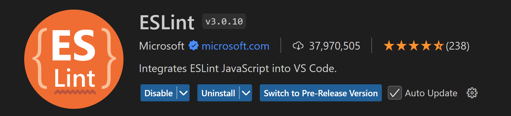
1. Add a new file under a folder named `src`, named `index.ts` - this will mean that `ESLint` will start running on our project.
    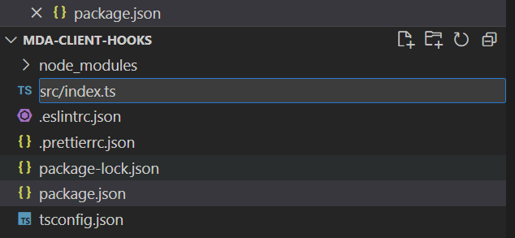
1. Close and Re-open **VS Code** ensure that `ESLint` is running. Select the **OUTPUT** tab, and select `ESLint`.   
   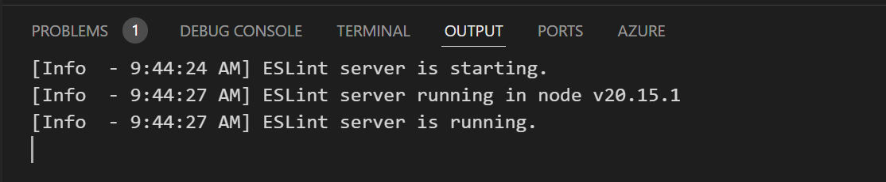

1. Open **File** -> **Preferences** -> **Keyboard Shortcuts**. Type `eslint`, and assign a keyboard short cut to the `eslint.executeAutofix` command. I use S`hift + Alt + P`.    
   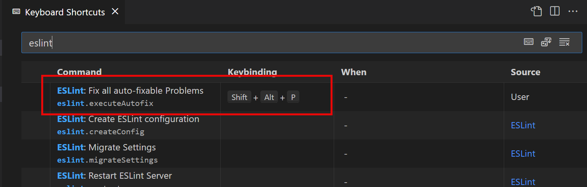

1. Later on, at the command line you should now be able to run:

    ```
    npm run lint
    ```

    and to fix any issues that are reported that can be fix automatically use:

    ```
    npm run lint:fix
    ```

See https://eslint.org/docs/user-guide/command-line-interface for more information.

## ✅ Create early bound types

One of the challenges with writing TypeScript code for Model Driven Apps, is that you need to know the names of the attributes. We can generate types to make this easier. 

1. At the command line, type:
   ```powershell
   npx dataverse-auth@2 https://yourorg.crm.dynamics.com device-code
   ```

   You can find your organization URL by opening **make.powerapps.com,** selecting your developer environment, and selecting the **gear icon** -> **Session Details**.   
   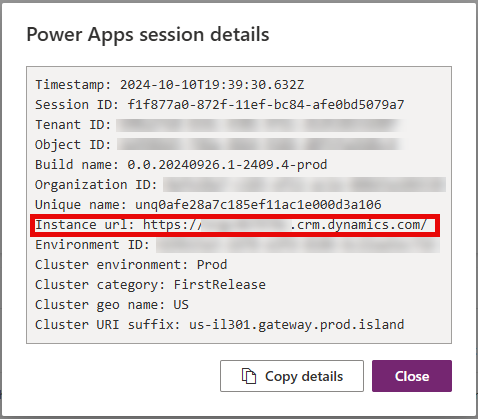

1. Follow the instructions and open https://microsoft.com/devicelogin in your browser profile, and enter the code given.

1. Consent to the login when prompted. You will see a message saying you are successfully authenticated with your username.

1. We can now generate the early bound types for the tables we are going to use. At the command line use:
   ```
   npx dataverse-gen@2 init
   ```

1. Select your developer environment.

1. When prompted, answer with the following:

   1. Generate form context helpers: **Y**
   1. Generate `dataverse-ify` entity types: **N**
   1. Select entities to include: **contoso_listing** (Type the name and use `SPACE` to toggle, then `RETURN`)
   1. Select actions to include: Press `RETURN` (selected no actions)
   1. Select functions to include: Press `RETURN` (selected no functions)
   1. Would you like to generate the types now? **Y**    
      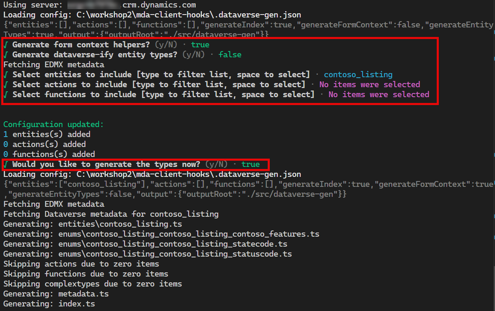

1. You will now have a folder called `dataverse-gen` that contains entity types, and a `.dataverse-gen.json` file:
   ```json
   {
     "entities": [
       "contoso_listing"
     ],
     "actions": [],
     "functions": [],
     "generateIndex": true,
     "generateFormContext": true,
     "generateEntityTypes": false,
     "output": {
       "outputRoot": "./src/dataverse-gen"
     }
   }
   ```

## ✅Install `@types/xrm`

The JavaScript we are going to write will use the `Xrm` Client Api. To enable strong types in our code we install the `@types/xrm` node module.

1. At the command line, Type:

    ```powershell
    npm install --save-dev @types/xrm
    ```

1. Add a new folders and file `src/forms/listing-form.ts`
1. Add the following code:

```
import { contoso_listingAttributes, contoso_listingFormContext } from '../dataverse-gen/entities/contoso_listing';
import { contoso_listing_contoso_listing_contoso_features } from '../dataverse-gen/enums/contoso_listing_contoso_listing_contoso_features';

export async function OnLoad(context: Xrm.Events.EventContext): Promise<void> {
    const formContext = context.getFormContext();
    console.log('OnLoad hook' + formContext.data.entity.getEntityName());
    formContext.getAttribute(contoso_listingAttributes.contoso_features).addOnChange(features_onchange);
    // Run the onchange event to show/hide the number of bathrooms field
    features_onchange(context as Xrm.Events.Attribute.ChangeEventContext);
}

function features_onchange(context: Xrm.Events.Attribute.ChangeEventContext): void {
    const formContext = context.getFormContext() as contoso_listingFormContext;
    console.log('OnLoad hook' + formContext.data.entity.getEntityName());

    // If the choices field contains parking, then enable the total parking spaces field
    const features = formContext
        .getAttribute<Xrm.Attributes.MultiSelectOptionSetAttribute>(contoso_listingAttributes.contoso_features)
        .getValue();

    if (features && features.includes(contoso_listing_contoso_listing_contoso_features.Parking)) {
        formContext.getControl(contoso_listingAttributes.contoso_TotalParkingSpaces).setVisible(true);
    } else {
        formContext.getControl(contoso_listingAttributes.contoso_TotalParkingSpaces).setVisible(false);
        formContext.getAttribute(contoso_listingAttributes.contoso_TotalParkingSpaces).setValue(null);
    }
}

```


If you type this in manually, you will see the intellisense for the Xrm types that is provided by the module `@types/xrm`.

If you make any changes to this file you may start to see red underlined areas that indicate ESLint formatting issues. Try changing the `const` to `var` - and see the warning that is shown.
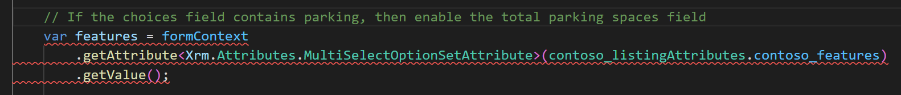

Use the VS Code command `ESLint: Fix all auto-fixable Problems` - if you assigned a keyboard short cut earlier - you can also use this.

> [!TIP]
>
> You can configure ESLint to run on save, however this will increase the time taken to save your files. We have chosen to run ESLint fix on build instead.

You may also see yellow underlined areas where there are ESLint issues. These cannot be auto-fixed, but you may ignore if needed by pressing `Ctrl + .` or ‘Quick Fix..’ and then **Disable for this line** or **Disable for the entire file**. This will add a comment into your code telling ESLint that you are ok to ignore the issues.

## ✅Installing webpack

To build your TypeScript you can use the TypeScript compiler `tsc`  - however this will create multiple JavaScript files. We only want a single JavaScript file to deploy as a Web Resource. We use webpack to do this bundling. It will also enable use to create a version of the Web Resource that is minimized for production use, as well as a version that we can use for debugging.

1. At the PowerShell command line run:
   ```powershell
   npm install --save-dev webpack webpack-cli @webpack-cli/generators ts-loader
   ```

1. Add a new file named `webpack.config.js`

   ```javascript
   // Set this to be the namespace of your library
   const namespace = ['Contoso', 'ListingsAdmin'];
   
   // Generated using webpack-cli https://github.com/webpack/webpack-cli
   const path = require('path');
   const isProduction = process.env.NODE_ENV === 'production';
   
   const config = {
       entry: './src/index.ts',
       output: {
           path: path.resolve(__dirname, 'dist'),
           filename: 'ClientHooks.js',
   
           library: namespace,
           libraryTarget: 'var',
       },
       plugins: [],
       module: {
           rules: [
               {
                   test: /\.(ts|tsx)$/i,
                   loader: 'ts-loader',
                   exclude: ['/node_modules/'],
               },
           ],
       },
       resolve: {
           extensions: ['.tsx', '.ts', '.jsx', '.js', '...'],
       },
   };
   
   module.exports = () => {
       if (isProduction) {
           config.mode = 'production';
       } else {
           config.mode = 'development';
           config.devtool = 'eval-source-map';
       }
       return config;
   };
   
   ```

   This will output a single bundle called `ClientHooks.js` with a namespace `Contoso.ListingsAdmin`.

1. Inside the `packages.json`, add the following additional build scripts:

   ```json
   "build": "webpack --mode=production --define-process-env-node-env=production",
   "build:dev": "npm run lint & webpack --mode=development & npm run test",
   "build:prod": "npm run lint & webpack --mode=production --define-process-env-node-env=production & npm run test",
   "watch": "webpack --watch",
   ```

1. You can now build the Web Resource using:

   ```powershell
   npm run build
   ```

1. Look in the `dist` folder and review the `ClientHooks.js` generated file. It will currently contain a very simple piece of JavaScript that does not contain the form script you created above.
   To add the code to the output, we must export it in the `index.ts` file:

   ```powershell
   // Export all of your modules here
   export * as ListingForm from './forms/listing-form';
   
   ```

   **Note:** It's important to include the blank space at the end since this will be checked by the lint rules.

1. Run the build again and notice how the code is now included.

1. If you run `npm run build:dev` you will see that the code is generated with a debug information. You will see how this is used later in this lab.

> [!TIP]
>
> You can use `npx webpack init` to create a webpack project from scratch - this is something you can experiment with in the future.

## ✅ Adding Unit Tests

Unit tests are a powerful way of ensuring that your code works before deploying it. We will use jest to test our code. Learn more at [Jest · 🃏 Delightful JavaScript Testing (jestjs.io)](https://jestjs.io/).

1. A the root of your project, add a new file called `jest.config.js`.
   ```json
   /* eslint-disable no-undef */
   module.exports = {
       preset: 'ts-jest',
       testEnvironment: 'node',
       roots: ['<rootDir>/src/'],
       transform: {
           '^.+\\.tsx?$': [
               'ts-jest',
               {
                   tsconfig: 'tsconfig.json',
               },
           ],
       },
   };
   
   ```

   

1. Install jest using:
   ```powershell
   npm install --save-dev @types/jest ts-jest
   ```

1. Mocking is the technique used in unit testing to create 'mock' versions of objects that would normally be provided by the runtime environment, to allow us to test in isolation. It also allows you to ensure that you are only testing the code that is the subject of your unit test. Read more about mocking here - [Mock object - Wikipedia](https://en.wikipedia.org/wiki/Mock_object)

   Install the `xrm-mock` library using:

   ```powershell
   npm install --save-dev xrm-mock
   ```

   

1. We can now add a unit test at `forms/__tests__/unit.listing-form.test.ts`

   ```typescript
   import { contoso_listingAttributes } from '../../dataverse-gen/entities/contoso_listing';
   import { contoso_listing_contoso_listing_contoso_features } from '../../dataverse-gen/enums/contoso_listing_contoso_listing_contoso_features';
   import { OnLoad } from '../listing-form';
   import { XrmMockGenerator } from 'xrm-mock';
   
   describe('OnLoad', () => {
       beforeEach(() => {
           XrmMockGenerator.initialise();
       });
   
       it('should execute the OnLoad function', async () => {
           // Mock the Xrm.Events.EventContext object
           const context = XrmMockGenerator.getEventContext();
           const featuresMock = XrmMockGenerator.Attribute.createOptionSet('contoso_features', [
               contoso_listing_contoso_listing_contoso_features.Parking,
               // eslint-disable-next-line @typescript-eslint/no-explicit-any
           ] as any);
           const totalParkingSpacesMock = XrmMockGenerator.Attribute.createNumber(
               contoso_listingAttributes.contoso_TotalParkingSpaces,
               0,
           );
   
           // Mock formContext.data.entity.getEntityName() to return 'contoso_listing'
           context.getFormContext().data.entity.getEntityName = jest.fn(() => 'contoso_listing');
   
           // Call the OnLoad function
           await OnLoad(context);
   
           // Check that totalParkingSpacesMock.setVisible was called
           expect(totalParkingSpacesMock.controls.get(0).getVisible()).toBe(true);
   
           // Set the featuresMock to be empty
           // eslint-disable-next-line @typescript-eslint/no-explicit-any
           featuresMock.setValue([] as any);
   
           // Call the OnLoad function
           await OnLoad(context);
   
           // Check that totalParkingSpacesMock.setVisible was called
           expect(totalParkingSpacesMock.controls.get(0).getVisible()).toBe(false);
       });
   });
   
   ```

   Note that the `__tests__` folder is a convention used by jest to discover tests.

1. Update the `package.json` script for test to be:

   ```json
   "test": "jest unit. --collectCoverage"
   ```

1. You can execute the tests using:

   ```powershell
   npm run test
   ```

1. Experiment with the tests, making them fail to see what happens. Code coverage shows how much of your code has been tested, broken down by each module.

1. Now build the production ready file using:

   ```powershell
   npm run build:prod
   ```
	You can look at the `dist/ClientHooks.js` and see how the JavaScript is now optimized for production deployment. 
## ✅ Deploying to Power Apps

Now we can build our Web Resource, we must deploy and register it as a form script.

1. Open **make.powerapps.com** and select your developer environment. 
1. Open the **Scottish Summit Developer Workshop** solution.
1. Navigate to **Web resources** -> **Listings Admin App Client Hooks Scripts**  
1. Select **Upload** a file, and locate the `dist/ClientHooks.js` file you built.
1. Select **Save**.
1. Navigate to **Tables** -> **Listing**  -> **Forms** -> **Listing** (Main Form)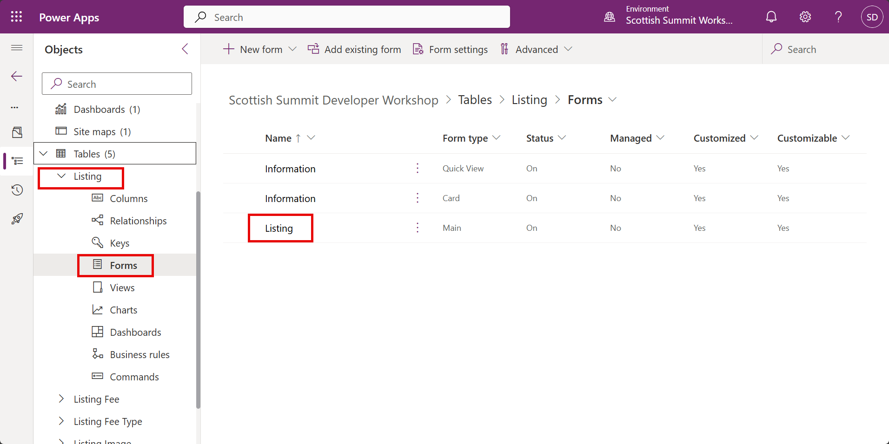
1. In the form designer, select **Events** on the right hand **Listing main form** panel, and then **On Load** -> **+ Event Handler**.
1. Select the Library `contoso_/portal-admin/mda-client-hooks.js` that you have just updated.
1. Enter the function `Contoso.ListingsAdmin.ListingForm.OnLoad`.
1. Check **Pass execution context as first parameter**.
1. Select **Done**.    
     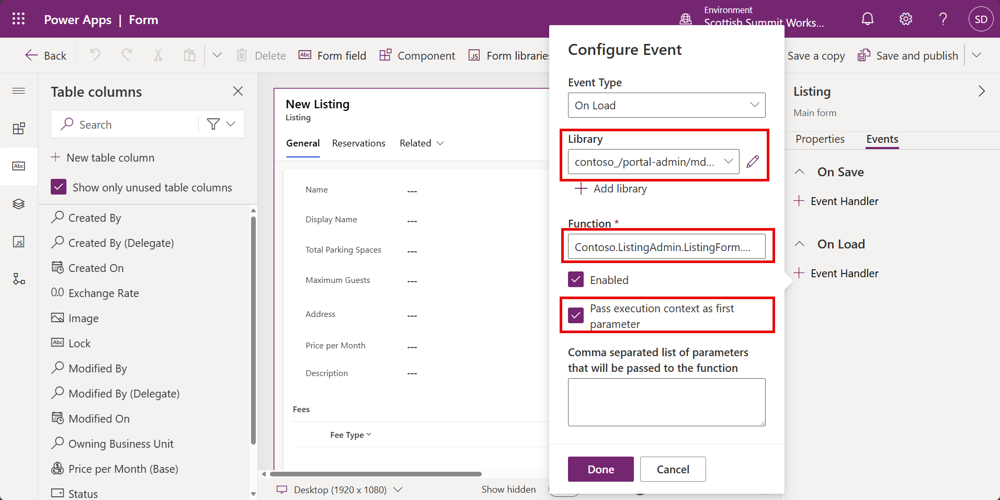
1. Select **Save and publish** -> **Back**.
1. Select **Apps** -> **Contoso Real Estate Administration** -> **... Ellipsis menu** -> **Play**.
1. Open a **Listing** record, and select **Parking** in the **Features**. You should see the **Total Parking Spaces** field hide/show.    
    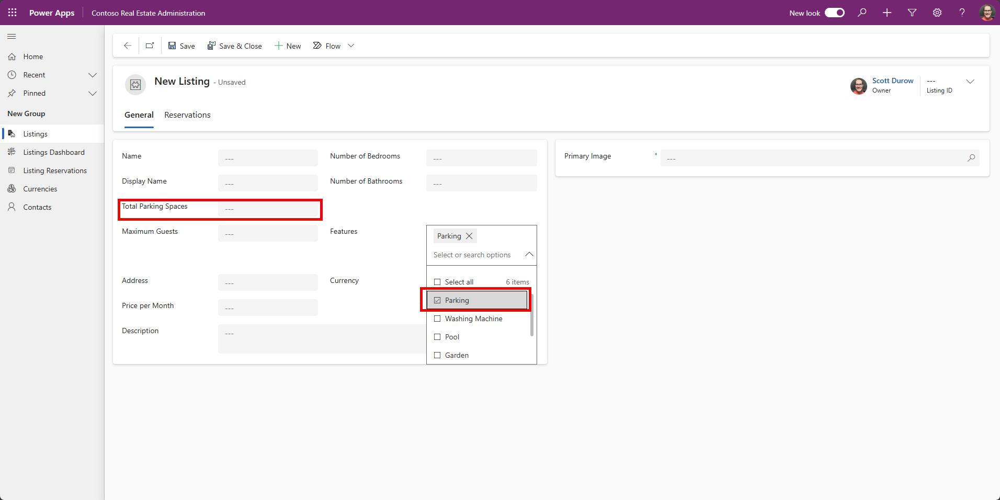

## ✅Debugging your Web Resource after deployment

You can use **Edge's F12 developer tools** to debug our web resources, however first we must create a development build and configure **Fiddler** to redirect the Web resource to load from our local version, not the version on the server. To debug your code component using Fiddler:

1. First, to create a developer version of your web resource, and watch for any changes, in VS Code at the PowerShell command line use:
   ```powershell
   npm run watch
   ```

   If you make any changes to the code, you will see webpack recompile the JavaScript output.

2. Download and install [Fiddler Classic](https://www.telerik.com/download/fiddler)

3. Open Fiddler and from the menu bar, go to **Tools**, and then select **Options**.

4. Select the **HTTPS** tab in the dialog box and check the **Capture HTTPS CONNECTS** and **Decrypt HTTPS traffic** checkboxes so that the HTTPS traffic is captured and then decrypted.

5. Select **OK** to close the dialog box.

   > [!NOTE]
   >
   > - If it is the first time you are enabling this setting, Fiddler will prompt you to install a certificate. Install the certificate and restart Fiddler so that the new settings take effect.
   > - If you have run Fiddler in the past and get a `NET::ERR_CERT_AUTHORITY_INVALID` error, in the **HTTPS** tab, select the **Actions** button and choose **Reset All Certificates**. This will also present multiple prompts for the new certificates to be installed.

6. In the right-hand panel, select **FiddlerScript**, and locate the function `static function OnBeforeResponse(oSession: Session) {` and replace it with:

   ```vbscript
       static function OnBeforeResponse(oSession: Session) {
           if (m_Hide304s && oSession.responseCode == 304) {
               oSession["ui-hide"] = "true";
           }
   
           if (oSession.oFlags.ContainsKey("x-repliedwithfile")) {
               oSession.oResponse["x-fiddler"] = oSession.oFlags["x-repliedwithfile"];
               // Set the Access-Control-Allow-Origin header to *
               oSession.oResponse["Access-Control-Allow-Origin"] = "*";
           }
       }
   
   ```

   > [!IMPORTANT]
   > This step is only necessary when debugging code components after they are deployed to canvas apps because the resources are stored in blob storage rather than underneath the `powerapp.com` domain. As such, any requests to these resources will require cross-domain access when loaded by the browser. Only enable this `Access-Control-Allow-Origin` filter rule when you are debugging since it will modify headers of other sites that you visit.

7. In the right-hand panel, select the **AutoResponder** tab.

8. Ensure that **Enable Rules** and **Unmatched requests passthrough** are checked.

9. Select **Add Rule** and enter first:

   ```
   regex:(?inx).+contoso_/portal-admin/mda-client-hooks.js
   ```

   This rule aims to match requests for the web resource and load the version locally instead.

10. Enter the following for the path to respond with:

   ```
   C:\workshop\mda-client-hooks\dist\ClientHooks.js
   ```

11. Select **Save**.     
    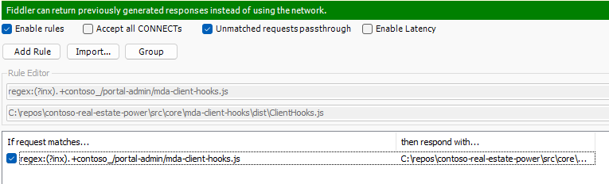

12. Now that you have the **AutoResponder** rules running you will need to first clear the cache in the browser and reload the page containing the code component. In Edge, open developer tools using `Ctrl + Shift + I`, and then right-click the **Refresh** > **Empty cache and hard refresh**.    
    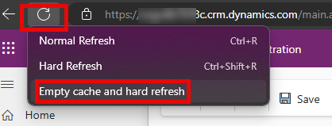

13. In the developer tools use `Ctrl + P`, and type `listing-form.ts`. Select the `listing-form.ts` from the list. This will load the TypeScript version of the JavaScript and allow you to debug using breakpoints.    
    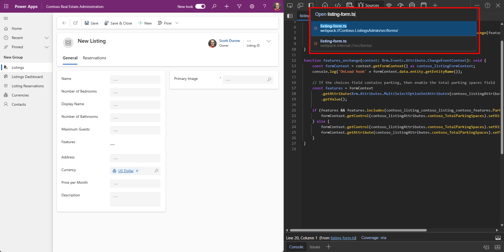

14. Place a breakpoint in the `onchange` function, and toggle the Parking feature. You can hover over the variables to see the variables, and step into/over lines.    
    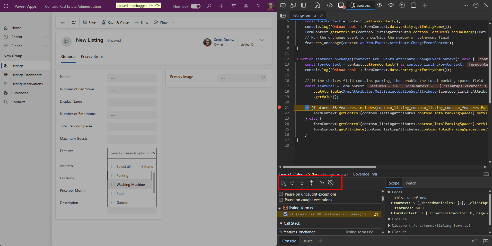

15. If you make a change to the code in VS Code, you can reload the form and see the updated form script. Once you are ready to deploy you can use `npm run build:prod` and update the Web resource content.

16. **Close fiddler** to stop the auto responder.

17. Inside VS Code at the PowerShell terminal that is running the watch, use `Ctrl + C` to stop the watch process.


## 🥳Congratulations

You have completed this lab on creating and debugging TypeScript Web resources.