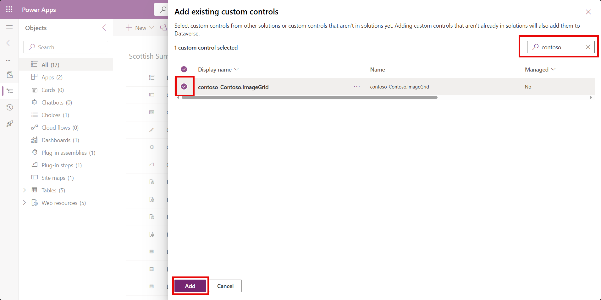
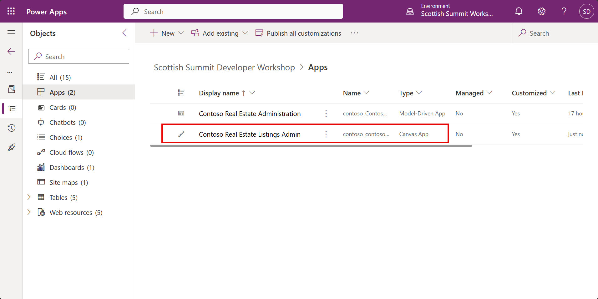
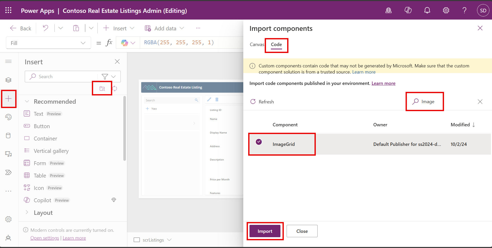
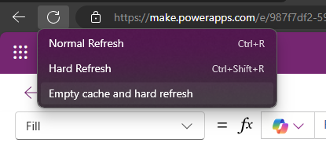
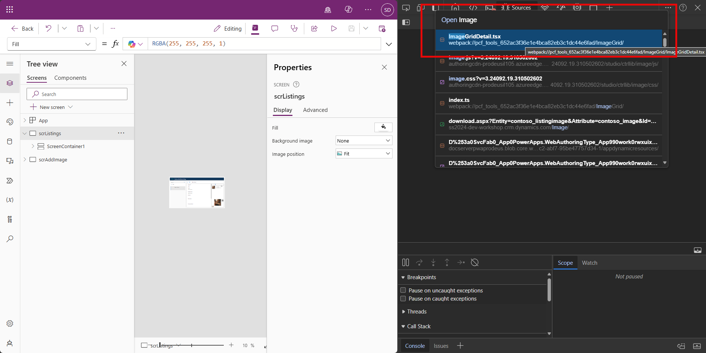
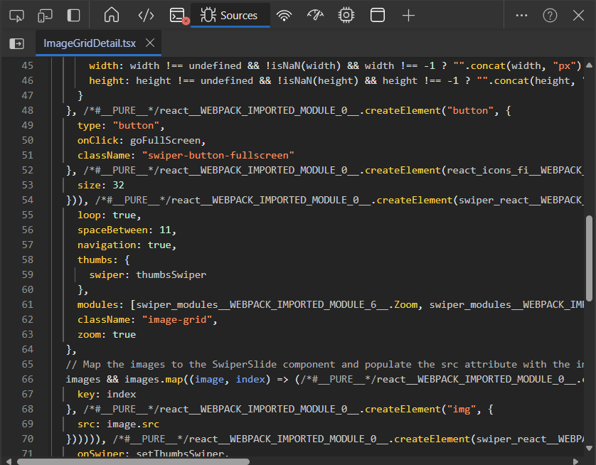

# 🚀 Lab 2: PCF Quick Start

Time to complete: **~45 minutes**

Welcome to this code-component (PCF) Deployment and Configuration lab - you'll be creating a image slide code component and deploying it to Power Apps.

## ✅Task 1: Enable Power Apps Component Framework

1. Inside Power Apps, select the **Gear icon** on the top right of the window and then select **Admin center** link.  
   
   > [!NOTE]
   > You can also select the 'kebab' menu from the environment picker and select **Go to admin center**.
   
1. Select **Environments** from the left navigation.

1. Select the **more ellipsis icon** against your Developer Environment, and then select the **Settings** menu item.  
   
1. Expand the **Product section** and select the **Features** link.  
   
1. Scroll down to the **Power Apps component framework for canvas apps**, and toggle the feature **On**.  
   
1. Scroll down to the bottom of the page and select **Save**.  


## ✅Task 2: Authorize PAC CLI

The Power Platform CLI allows us to perform many operations on the Power Platform. We will use it to quickly create a code component project using either a field or dataset template. 

### 👉Install the PAC CLI

1. Inside **VSCode**, Select **Extensions** icon from the **Activity bar** (`Ctrl+Shift+X`).
2. In the search bar, enter **Power Platform Tools**.
3. Select **Install**.  
4. After a short wait, you will see the message `The pac CLI is ready for use in your VS Code terminal`:  

### 👉Authorize the PAC CLI

1. Run the following command at the new terminal in your Code Space:

   ```bash
   pac auth create --deviceCode
   ```

   > [!NOTE]
   >If you see an error then close any existing terminals and open a new one using ```Ctrl+Shift+` ```
   
1. Copy the https://microsoft.com/devicelogin link and paste it into the **browser profile window that you created earlier**. 

1. Copy the code, and paste it into the **Enter code** prompt and select **Next**.  
   
1. Select the Workshop User account that is Signed In. If you do not see it, then select **Use another account**, type in your workshop username and password, and click **Sign in**.

> [!NOTE]
>If you are using an environment other than your own developer environment, ensure you log in as an administrator on that environment when prompted. The privileges provided by these roles are needed to deploy any code components to Dataverse.

9. If you see a **Pick an account** screen, select your workshop user which should say *Signed In* next to it.

10. You will then see a page asking if you're trying to sign in to Power Platform CLI - pac.  
    
11. Click **Continue**
    You'll then see a prompt confirming that you have successfully signed in to Power Platform CLI - pac. Close the browser tab and return to your codespace.  
    
12. The Code space terminal should show the message **Authentication profile created** showing the workshop user you were provided.  
    
13. At the terminal type `pac auth list`. You will see the new auth profile with an asterisk (*) next to it indicating that it is the currently selected profile. The profiles is created as **UNIVERSAL** meaning that it is not specific to any specific environment.  
    
14. To select our developer environment, expand the Power Platform left panel. If you do not see the **UNIVERSAL** profile, hover over the AUTH PROFILES area and select **Refresh**.
    
    > [!IMPORTANT]
    > If you do not see the power platform extension logo as in the screenshot below, press `Ctrl + Shift + P`, and then type `Developer: Reload Window` and press `ENTER`.
    
15. To select our developer environment, use the Star icon **Select Environment**. The Environment then should have a filled star next to it.  
    
16. If you now run `pac auth list` you will see the URL of the environment you have selected listed. The asterisk (*) indicates that this is the currently selected auth profiles if you have multiple different profiles for different tenants. You can switch using `pac auth select --index`  
    
    > [!NOTE]
    > You can also select an environment by using
    >  `pac org select --envrionment <URL/ID/Unique Name/Partial Name>`
    
17. To ensure that you are connected to the correct environment, at the terminal type `pac org who`
    This will show the current connection and environment selected.  


## ✅Task 3 Initialize the pcf project

We are creating the image slider, it will be bound to a dataset of images, so we use the `pac pcf init` command to create a TypeScript project using the dataset template. You can also use the field template for a single value control.

### 👉Initialize pcf project using pac pcf init

1. Open the VS Code PowerShell terminal, and create a folder `c:/workshop/image-grid-pcf`

   ```
   mkdir c:/workshop/image-grid-pcf
   ```

2. In the terminal create a new component project by passing basic parameters using the command:

   ```bash
   pac pcf init --namespace Contoso --name ImageGrid --template dataset --run-npm-install --outputDirectory "c:/workshop/image-grid-pcf" --framework react
   ```

   > [!NOTE]
   >The **namespace** is used to create a unique name for the control to prevent collisions with other controls of the same name. 
   > When deploying later, we will also provide a **solution publisher prefix** that will add an additional level of uniqueness that defines the solution publisher that owns the code component.

3. The above command also runs the `npm install` command for you:

   ```bash
   Running 'npm install' for you...
   ```

   This automatically downloads the project dependencies that are listed in the `package.json` file into the `node_modules` folder. This folder never needs to be checked in to code repositories since it will always be restored before the code is built. 

   > [!NOTE]
   > If you see any yellow warning text, this can safely be ignored.

4. Open the new PCF project by using

   ```powershell
   code c:/workshop/image-grid-pcf -r 
   ```

5. Take a moment to look through the files created:  

   - `package.json` - defines the modules required to build the code-component and the scripts that can be run to build/debug the code. The important modules are `pcf-scripts` and `pcf-start`. Note how these are set to always pick the latest version `^1` with the major version set to 1.
   - `ImageGrid\ControlManifest.Input.xml` - defines the metadata for the code component - including the properties that it exposes to the Power Apps runtime and any resources required. More information: [Manifest](https://docs.microsoft.com/en-us/powerapps/developer/component-framework/manifest-schema-reference/manifest).
   - `ImageGrid\index.ts` - the class that will be instantiated when the code component is added to Power Apps, with the following key interface members:
     - `init` - used to initialize the component instance including any remote server calls. The context is provided that includes the root HTML DOM element that the code component will be added to.
     - `updateView` - called by Power Apps when any data is available to be passed into the component or if any dependent properties change.
     - `getOutputs` - called by Power Apps to get the value of any output/bound properties after the component has notified the framework by calling `notifyOutputChanged`.
     - `destroy` - called by Power Apps when the code component is removed from the DOM, so that it can clean up and release any resources it may be using.
     - `ImageGrid\generated\ManifestTypes.d.ts`  - Automatic generated types from the `ControlManifest` to make it easier to work with the inputs and outputs defined. These types are re-generated with each build and should never be edited manually.
     - `ImageGrid.pcfproj`  - defines the project settings for the code component project that is used when build a solution.

### 👉Defining the code components Metadata using the Control Manifest

Our code component will be bound to a dataset of image records. It also needs a property that will control the height when placed on a form in a Model Driven Form.

1. Locate the manifest at `ImageGrid\ControlManifest.Input.xml` and open inside **VSCode**. The [control](https://docs.microsoft.com/en-us/powerapps/developer/component-framework/manifest-schema-reference/control) attributes will already contain the `namespace` and `name` of your component that was provided to `pac pcf init`.

2. Replace the `data-set` definition named `sampleDataSet` with the following:

   ```xml
   <data-set name="Images" display-name-key="Images">
     <property-set name="ImageName"
                   display-name-key="ImageName"
                   of-type="SingleLine.Text"
                   usage="bound"
                   required="true" />
     <property-set name="ImageContent"
                   display-name-key="ImageContent"
                   of-type="SingleLine.Text"
                   usage="bound"
                   required="false" />
   </data-set>
   <!-- Property to store the overridden height in a model driven form -->
   <property name="SubGridHeight" display-name-key="Sub Grid Height for Model Driven Forms" of-type="Whole.None" usage="input" required="false" />
   ```

4. **Save** the changes and then use the following command at the terminal (```Ctrl+` ```  to open the terminal) to build the component:

   ```bash
   npm run refreshTypes
   ```

The `refreshTypes` command is defined inside the `packages.json`.  

An automatically generated file `ImageGrid\generated\ManifestTypes.d.ts` is added to your project. This is generated as part of the build process from the `ControlManifest.Input.xml` and provides the types for interacting with the input/output properties. The `IOutputs` interface only contains the properties that are set as `bound` or `output` .

> [!IMPORTANT]
>Do not modify the contents of the `generated` and `out` folders directly. They'll be overwritten as part of the build process with each build.

## ✅Task 04 - Adding additional resources

Our manifest contains references to resource string keys so that we can provide multiple language translations if required. Our code component will also use a `CSS` file for styling. These additional files must be referenced in the resources section.

1. Locate the `resources` element in the `ImageGrid\ControlManifest.Input.xml` file.

2. Replace with the following:

   ```xml
   <resources>
     <code path="index.ts" order="1"/>
     <css path="image-grid.css" order="1" />
     <platform-library name="React" version="16.8.6" />
   </resources>
   ```

   The final ControlManifest.Input.xml should look similar to:
   ```xml
   <?xml version="1.0" encoding="utf-8" ?>
   <manifest>
     <control namespace="Contoso" constructor="ImageGrid" version="0.0.1" display-name-key="ImageGrid" description-key="ImageGrid description" control-type="virtual" >
       <!--external-service-usage node declares whether this 3rd party PCF control is using external service or not, if yes, this control will be considered as premium and please also add the external domain it is using.
       If it is not using any external service, please set the enabled="false" and DO NOT add any domain below. The "enabled" will be false by default.
       Example1:
         <external-service-usage enabled="true">
           <domain>www.Microsoft.com</domain>
         </external-service-usage>
       Example2:
         <external-service-usage enabled="false">
         </external-service-usage>
       -->
       <external-service-usage enabled="false">
         <!--UNCOMMENT TO ADD EXTERNAL DOMAINS
         <domain></domain>
         <domain></domain>
         -->
       </external-service-usage>
       <!-- dataset node represents a set of entity records on CDS; allow more than one datasets -->
       <data-set name="Images" display-name-key="Images">
         <property-set name="ImageName"
                       display-name-key="ImageName"
                       of-type="SingleLine.Text"
                       usage="bound"
                       required="true" />
         <property-set name="ImageContent"
                       display-name-key="ImageContent"
                       of-type="SingleLine.Text"
                       usage="bound"
                       required="false" />
       </data-set>
       <!-- Property to store the overridden height in a model driven form -->
       <property name="SubGridHeight" display-name-key="Sub Grid Height for Model Driven Forms" of-type="Whole.None" usage="input" required="false" />
       <resources>
         <code path="index.ts" order="1"/>
         <css path="image-grid.css" order="1" />
         <platform-library name="React" version="16.8.6" />
       </resources>
       <!-- UNCOMMENT TO ENABLE THE SPECIFIED API
       <feature-usage>
         <uses-feature name="Device.captureAudio" required="true" />
         <uses-feature name="Device.captureImage" required="true" />
         <uses-feature name="Device.captureVideo" required="true" />
         <uses-feature name="Device.getBarcodeValue" required="true" />
         <uses-feature name="Device.getCurrentPosition" required="true" />
         <uses-feature name="Device.pickFile" required="true" />
         <uses-feature name="Utility" required="true" />
         <uses-feature name="WebAPI" required="true" />
       </feature-usage>
       -->
     </control>
   </manifest>
   ```

3. Right click on the `ImageGrid` folder, and select **New File**. Enter the file name `image-grid.css` and enter the following content:

   ```css
   .swiper {
       width: 100%;
       height: 100%;
     }
     
     .swiper-slide {
       text-align: center;
       font-size: 18px;
       background: #fff;
     
       /* Center slide text vertically */
       display: flex;
       justify-content: center;
       align-items: center;
     }
     
     .swiper-slide img {
       display: block;
       width: 100%;
       height: 100%;
       object-fit: contain;
     }
   
     .swiper {
       width: 100%;
       height: 300px;
       margin-left: auto;
       margin-right: auto;
     }
     
     .swiper-slide {
       background-size: cover;
       background-position: center;
     }
     
     .image-grid {
       height: 80%;
       width: 100%;
     }
     
     .image-grid-thumbs {
       height: 20%;
       box-sizing: border-box;
       padding: 10px 0;
     }
     
     .image-grid-thumbs .swiper-slide {
       width: 25%;
       height: 100%;
       opacity: 0.4;
     }
     
     .image-grid-thumbs .swiper-slide-thumb-active {
       opacity: 1;
     }
     
     .swiper-slide-thumbs img {
       display: block;
       width: 100%;
       height: 100%;
       object-fit: cover;
     }
     
     .swiper-button-prev,
     .swiper-button-next {
       background: rgba(0, 0, 0, 0.5);
       border-radius: 4px;
       padding: 4px;
       color: #fff;
     }
   
     .swiper-button-fullscreen {
       position: absolute;
       top: 10px;
       right: 10px;
       background: rgba(0, 0, 0, 0.5);
       border-radius: 4px;
       padding: 4px;
       border: none;
       z-index: 1000;
       color: #fff;
     }
   ```

4. **Save** the files.

## ✅Task 09 - Add the code 

We now add the TypeScript code for our component. TypeScript is similar to JavaScript and in fact is based on the most recent specifications of JavaScript. It has the advantage that it is statically typed and provides modern programming features that are not supported by JavaScript running inside the browser. When the code is built, it is 'transpiled' into JavaScript so that it can run. More information: [TypeScript and JavaScript](https://docs.microsoft.com/en-us/powerapps/developer/component-framework/code-components-best-practices#typescript-and-javascript)

### 👉Add the code

1. Install the swiper and icon library by running at the PowerShell terminal:

   ```
   npm install swiper react-icons
   ```

2. Right click on the `ImageGrid` folder and select **New File**. Create a file named `ImageGridDetail.tsx` with the following code:

   ```typescript
   import * as React from 'react';
   import { FiMaximize2 } from 'react-icons/fi'; // Import the fullscreen icon
   import { Swiper, SwiperClass, SwiperSlide } from 'swiper/react';
   import 'swiper/css';
   import 'swiper/css/free-mode';
   import 'swiper/css/navigation';
   import 'swiper/css/thumbs';
   import { FreeMode, Navigation, Thumbs, Zoom } from 'swiper/modules';
   
   export interface ISliderPhoto {
       src: string;
       title: string;
   }
   
   export interface ImageSliderProps {
       images: ISliderPhoto[];
       width: number;
       height: number;
   }
   
   export const ImageGridDetail = ({ width, height, images }: ImageSliderProps) => {
       const [thumbsSwiper, setThumbsSwiper] = React.useState<SwiperClass>();
   
       const swiperRef = React.useRef<HTMLDivElement>(null);
   
       const goFullScreen = () => {
           const swiperNode = swiperRef.current;
   
           if (swiperNode) {
               if (document.fullscreenElement) {
                   document.exitFullscreen();
               } else {
                   swiperNode.requestFullscreen();
               }
           }
       };
   
       return (
           <div
               ref={swiperRef}
               style={{
                   margin: '0 auto',
                   position: 'relative',
                   width: width !== undefined && !isNaN(width) && width !== -1 ? `${width}px` : '100vh',
                   height: height !== undefined && !isNaN(height) && height !== -1 ? `${height}px` : '100vh',
               }}
           >
               <button
                   type="button"
                   onClick={goFullScreen}
                   className="swiper-button-fullscreen"
               >
                   <FiMaximize2 size={32}/>
               </button>
               <Swiper
                   loop={true}
                   spaceBetween={11}
                   navigation={true}
                   thumbs={{ swiper: thumbsSwiper }}
                   modules={[Zoom, FreeMode, Navigation, Thumbs]}
                   className="image-grid"
                   zoom={true}
               >
                   {
                       // Map the images to the SwiperSlide component and populate the src attribute with the image URL
                       images &&
                           images.map((image, index) => (
                               <SwiperSlide key={index}>
                                   
                               </SwiperSlide>
                           ))
                   }
               </Swiper>
               <Swiper
                   onSwiper={setThumbsSwiper}
                   loop={true}
                   spaceBetween={10}
                   slidesPerView={4}
                   freeMode={true}
                   watchSlidesProgress={true}
                   modules={[FreeMode, Navigation, Thumbs]}
                   className="image-grid-thumbs"
               >
                   {
                       // Map the images to the SwiperSlide component and populate the src attribute with the image URL
                       images &&
                           images.map((image, index) => (
                               <SwiperSlide key={index}>
                                   
                               </SwiperSlide>
                           ))
                   }
               </Swiper>
           </div>
       );
   };
   
   ```
   
   
   
3. Open the `index.ts` and replace with the following code:

   ```typescript
   import { IInputs, IOutputs } from './generated/ManifestTypes';
   import * as React from 'react';
   import { ISliderPhoto, ImageGridDetail } from './ImageGridDetail';
   
   export class ImageGrid implements ComponentFramework.ReactControl<IInputs, IOutputs> {
       private theComponent: ComponentFramework.ReactControl<IInputs, IOutputs>;
       private notifyOutputChanged: () => void;
       private images: ISliderPhoto[];
   
       /**
        * Used to initialize the control instance. Controls can kick off remote server calls and other initialization actions here.
        * Data-set values are not initialized here, use updateView.
        * @param context The entire property bag available to control via Context Object; It contains values as set up by the customizer mapped to property names defined in the manifest, as well as utility functions.
        * @param notifyOutputChanged A callback method to alert the framework that the control has new outputs ready to be retrieved asynchronously.
        * @param state A piece of data that persists in one session for a single user. Can be set at any point in a controls life cycle by calling 'setControlState' in the Mode interface.
        */
       public init(context: ComponentFramework.Context<IInputs>, notifyOutputChanged: () => void): void {
           this.notifyOutputChanged = notifyOutputChanged;
           context.mode.trackContainerResize(true);
       }
   
       /**
        * Called when any value in the property bag has changed. This includes field values, data-sets, global values such as container height and width, offline status, control metadata values such as label, visible, etc.
        * @param context The entire property bag available to control via Context Object; It contains values as set up by the customizer mapped to names defined in the manifest, as well as utility functions
        * @returns ReactElement root react element for the control
        */
       public updateView(context: ComponentFramework.Context<IInputs>): React.ReactElement {
           // Check if the user is the test harness which does not provide updatedProperties
           const isTestHarness = context.userSettings.userId === '{00000000-0000-0000-0000-000000000000}';
   
           // Check if the dataset has changed or if the user is the test harness
           const datasetChanged = !this.images || context.updatedProperties.indexOf('dataset') > -1;
   
           if (datasetChanged || isTestHarness) {
               // Get the images dataset from the PCF context
               const dataset = context.parameters.Images;
               // In Model Driven Apps, you cannot set the image column to a data set alias
               // Are there any columns in the dataset that has the alias of ImageContent?
               let imageValueColumn = dataset.columns.find(
                   (column) => column.alias === 'ImageContent' || column.dataType === 'Image',
               )?.name;
   
               // In Power Pages the column data type is a string not Image
               if (!imageValueColumn)
                   imageValueColumn = dataset.columns.find(
                       // eslint-disable-next-line @typescript-eslint/no-explicit-any
                       (column) => (column as any).attributes?.AttributeTypeName?.Value === 'ImageType',
                   )?.name;
   
               if (imageValueColumn) {
                   // Convert the dataset records into the ISliderPhoto interface
                   this.images = dataset.sortedRecordIds.map((id) => {
                       const record = dataset.records[id];
                       const imageValue =
                           // eslint-disable-next-line @typescript-eslint/no-explicit-any
                           imageValueColumn != null ? (record.getValue(imageValueColumn) as any) : undefined;
                       let fileContent = '';
   
                       if (isTestHarness) {
                           // Support the PCF tester where the image is a string
                           fileContent = imageValue;
                       } else if (imageValue?.fileUrl) {
                           fileContent = imageValue.fileUrl;
                       } else if (imageValue?.thumbnailUrl) {
                           fileContent = imageValue.thumbnailUrl + '&Full=true';
                       }
   
                       // Support Model Driven Apps where the image content is a thumbnail string
                       if (!fileContent) {
                           //
                           // if (imageColumn) {
                           // Construct the image URL in the format /Image/download.aspx?entity=<entity_logicalname>&attribute=<attribute>&ID=<recordid>&Full=true
                           const entityLogicalName = dataset.getTargetEntityType();
                           const attribute = imageValueColumn;
                           const recordId = record.getRecordId();
                           fileContent = `/Image/download.aspx?entity=${entityLogicalName}&attribute=${attribute}&ID=${recordId}&Full=true`;
                           // }
                       }
   
                       // Return the ISliderPhoto object
                       return {
                           id: record.getRecordId(),
                           title: record.getValue('ImageName') as string,
                           src: fileContent ? fileContent : '',
                       } as ISliderPhoto;
                   });
               }
           }
   
           const allocatedWidth = parseInt(context.mode.allocatedWidth as unknown as string);
           const allocatedHeight = parseInt(context.mode.allocatedHeight as unknown as string);
           const modelDrivenAppSubGridHeight = context.parameters.SubGridHeight.raw;
           return React.createElement(ImageGridDetail, {
               width: allocatedWidth,
               height:
                   modelDrivenAppSubGridHeight !== null && modelDrivenAppSubGridHeight > 0
                       ? modelDrivenAppSubGridHeight
                       : allocatedHeight,
               images: this.images,
           });
       }
   
       /**
        * It is called by the framework prior to a control receiving new data.
        * @returns an object based on nomenclature defined in manifest, expecting object[s] for property marked as "bound" or "output"
        */
       public getOutputs(): IOutputs {
           return {};
       }
   
       /**
        * Called when the control is to be removed from the DOM tree. Controls should use this call for cleanup.
        * i.e. cancelling any pending remote calls, removing listeners, etc.
        */
       public destroy(): void {
           // Add code to cleanup control if necessary
       }
   }
   
   ```

   

4. Make sure all files are **Saved**.

## ✅Task 10 - Build and test using the test harness

The pcf project comes with a simple test harness that allows you to run and test your pcf component. It does not provide a full set of features but is good for simple debugging.

### 👉 Start the test harness

1. Inside VS Code terminal (Use `Ctrl+'` to toggle visibility if you do not see a terminal panel) run the following command:

```bash
npm start watch
```

2. After a short build process, you will may see a popup block indicator in the top right. Select **Allows allow pop-ups and redirects** and **Done**.
   This allows you to test your component in window that simulates the Power Apps runtime. 
   Changes made to any of the following component assets are automatically reflected in the test harness without having to restart it:

   - Your typescript code.

   - All of the resources listed in the `ControlManifest.Input.xml` file, for example the `css` and `resx` files.

2. If you make changes to any of these files, you'll see a `Change detected` message and the browser will reload with the updated code.

2. In the far right panel, under **Data Inputs** -> **Select a file** -> `C:/WorkshopStarterSolution/SliderImages.csv` (From the lab folder)

2. Select `ImageName` and `ImageContent` in the drop downs and select **Apply**.

2. You will see the image slider populated with images. Try swiping left/right and opening full screen.

### 👉Common limitations when using the test harness

While the test harness is suitable for testing simple code components, the following scenarios may mean that the test harness cannot be used to test a more complex code component:

1. The [updatedProperties](https://docs.microsoft.com/en-us/powerapps/developer/component-framework/reference/updatedproperties) array is not populated when properties are changed via the test harness **Data Inputs** section.
2. Using features listed in the `feature-usage` section of the `ControlManifest.Input.xml`. For example, calling the `context.WebApi.*` methods will throw an exception from within the test harness.
3. Use of the [paging](https://docs.microsoft.com/en-us/powerapps/developer/component-framework/reference/paging), [sorting](https://docs.microsoft.com/en-us/powerapps/developer/component-framework/reference/sortstatus), and [filtering](https://docs.microsoft.com/en-us/powerapps/developer/component-framework/reference/filtering) APIs on datasets will throw an exception from within the test harness.
4. Use of complex datatype bindings that provide additional metadata such as choices and lookups. For choice columns, the test harness will give you three simple choices with minimal metadata.
5. Model-driven apps specifics such as field level security, read-only behavior, dataset selection API, and integration with the model-driven apps command bar.
6. Other context APIs such as [Navigation](https://docs.microsoft.com/en-us/powerapps/developer/component-framework/reference/navigation) and [Utility](https://docs.microsoft.com/en-us/powerapps/developer/component-framework/reference/utility) methods.

## ✅Task 11 - Debugging in the test harness

Try the following:

1. Inside the test-harness browser window, press `F12` or `Ctrl+Shift+I`
2. The first time you do this, you are presented with the dialog asking if you wish to open the Developer Tools. Check **Remember my decision** and select **Open DevTools**.  
3. You will now see the Developer tools in the right hand pane of the browser.
4. On the **Sources** tab, select **Open file** using the ellipses menu (`Ctrl+P`):  
5. Type `index.ts` and press `Enter`. Make sure that the `index.ts` you are opening has `ImageSlider` in the file path. This will be important when you do the same task later on where there could be multiple controls loaded into the session.  
6. You will see source the source code that looks very similar (but not identical) to your TypeScript source.
   More information on why there are differences: [ES6 vs ES5](https://docs.microsoft.com/en-us/powerapps/developer/component-framework/debugging-custom-controls#es5-vs-es6).
7. Add a break-point inside `updateView` by clicking to the left of the line number.
8. Refresh the page.
9. You can step through the code to debug.

More information: [Debugging a code component](https://docs.microsoft.com/en-us/powerapps/developer/component-framework/debugging-custom-controls)

> [!IMPORTANT]
>Using `npm start` and `npm start watch` builds your code component optimized for development and debugging. This code would not normally be deployed to Microsoft Dataverse. More information: [Code Components Application Lifecycle Management](https://docs.microsoft.com/en-us/powerapps/developer/component-framework/code-components-alm). In the next lab we will package the code component for importing into Microsoft Dataverse and select different build modes for development vs production.

## ✅Task 12 - Stop the test harness

To stop the test harness and remove the forwarded port, simply use `Ctrl + C` in the terminal that is watching for changes. 

If you now refresh the test harness page, you will see the **HTTP 404 Not Found** error page.


# ✅Task 03 - Deploying to Microsoft Dataverse during testing and development

So far we have used the test harness to debug the code component. This has several limitations and code components should always be deployed to Microsoft Dataverse to fully test. In some cases (e.g. when using advanced features such as the `WebApi` or complex component lifecycles), deploying and configuring inside Dataverse is the only way to test your component. 

## 👉Ensure code components are enabled for your environment in canvas apps

Each environment needs to have PCF controls enabled before they can be used in Canvas Apps.

1. At the PowerShell terminal, use:

   ```powershell
   pac env update-settings --name "iscustomcontrolsincanvasappsenabled" --value true
   ```

This can also be done manually using:

1. Navigate to https://admin.powerplatform.microsoft.com

   > [!NOTE]
   > You can also select the **settings 'gear'** menu in the top right of your Power Platform Environment and select **Admin centre**, or select the 'kebab' menu from the environment picker and select **Go to admin center**

1. Select your development environment.

1. Select **Settings** - > **Product** -> **Features**.

1. Ensure **Power Apps component framework for canvas apps** is toggled **On**. 

1. Select **Save** (if setting changed).

## 👉Deploy your code component

You should have authorized the **Microsoft Power Platform CLI** against your environment so that you can push the compiled code component.

1. To ensure that your code component is always deployed in it's production build state so that you do not hit size limits, open the `image-grid.pcfproj`, and add the `PcfBuildMode` element to to the `PropertyGroup` that has the `OutputPath` element in it:

   ```xml
   <PropertyGroup>
     <Name>image-grid-pcf</Name>
     ...
     <PcfBuildMode>production</PcfBuildMode>
       
   </PropertyGroup>
   ```

   This will ensure that all `pac pcf push` builds will be in **production** mode.

   Save the file.

2. **IMPORTANT:** Ensure you are authorized and connected to the correct environment by running `pac org who`.

3. To deploy your code component, use the following at the terminal:

   ```bash
   pac pcf push --publisher-prefix Contoso
   ```

   The project will build and a temporary solution be create to deploy the code component.

4. Open [make.powerapps.com](https://make.powerapps.com) and navigate to **Solutions**. You should see a temporary solution named **PowerAppTools_samples** in your environment that was created as part of the push process. The `ImageGrid` code component will be added to this solution. 

5. We need to add this component to our main solution. Open the **Power Platform Pro Developer Workshop** solution in **make.powerapps.com**.

6. Select **Add existing** -> **Developer** -> **Custom control** -> Search for `contoso` -> Select the `contoso_Contoso.ImageGrid` -> **Add**.     
   

## 👉Use the component in a Canvas App

1. Select **Apps** -> **Contoso Real Estate Listings Admin**     
   

1. In the **Insert** left hand panel, select the **Get more components** icon -> **Code** tab - > **Search for Image** -> **ImageGrid** -> **Insert**.

   

1. In the **Tree view**, select `srcListings.ScreenContainer1.BodyContainer1.RightContainer1.MainContainer1.conImagesroot`

1. In the **Insert** menu, select **Code** components -> `ImageGrid`

1. In the Properties panel, set the following properties:

    1. Images(Items) : `Filter('Listing Images',Listing.Listing = RecordsGallery1.Selected.Listing)`
    2. Align in container: **Custom** -> **Stretch**
    3. Flexible height: **On**

1. In the Advanced tab, set the following properties:

    1. `ImageContent`: `"contoso_image"`
    2. `ImageName`: `"contoso_name"`

1. Now add some properties and images, and see the image slider showing those images.

> [!IMPORTANT]
>When you create code-component you provide a namespace that is added to the control manifest file. This is used when building the code and will be included in the `bundle.js` generated output. The publisher prefix on the other hand is not referenced in the code but is used to control which solution publisher owns a code-component and cannot be changed after deployment. Makes sure you set the solution prefix to the one that you want to use to deploy your code component right from the start.

More information: [Code Component Application Lifecycle Management (ALM)](https://docs.microsoft.com/en-us/powerapps/developer/component-framework/code-components-alm).  

# ✅Task 05 - Configuring local debugging

Now that you have your code component running inside Canvas Apps, you will likely need to debug it. Currently the code component will be deployed in the production build state.

1. In VS Code, ensure that your code component is running in watch mode to create the developer version of the bundle.js. At the PowerShell terminal use:

   ```powershell
   npm start watch
   ```

1. Open Fiddler that you installed and configured in the previous lab.

1. As before, in the **AutoResponder** tab, select **Add Rule:**

   - `regex:(?inx).+Resources0Controls0Contoso.ImageGrid.bundle.js`
   - `C:\workshop\image-grid-pcf\out\controls\ImageGrid\bundle.js`

1. **Save** the Canvas App, and then open the **Developer Tools** using `Ctrl + Shift + I`.

1. Right click on the **refresh** icon and select **Empty cache and hard refresh**.    
     

1. In the developer tools Sources tab, use `Ctrl + P` to open `ImageGridDetail.tsx`.    
   

1. You'll notice that the `tsx` looks rather different - this is due to the compiled nature of React code. The React markup is converted into `createElement` statements.    
   

1. Now open `index.tsx` and set a break point in `updateView`.

1. Use the App and see how the break points are hit.

1. When you are ready to publish your updated code, **close Fiddler**, increment the 3rd part of the version in the `ControlManifest.Input.xml` and repeat the `pac pcf push`.

1. Now **close fiddler** if it is still running.

## 🥳Congratulations!

Now that you have completed this lab you have learned how to create a code component (PCF) and test it using the test-harness and in canvas apps. If you have time, update the ESLinting in your PCF project using the configuration in the previous lab, and fix any issues that it shows.

