# 🚀 Lab 4: Custom Connectors

Time to complete: **~45 minutes**

Power Platform Custom Connectors allow you to call external services from inside Power Apps, Power Automate, and Copilot Studio. In this lab, we will create a C# Web Api, create a custom connector, and then call it via Copilot Studio using Generative AI features.

## ✅ Task 1 : Initialize the C# Web Api project

Visual Studio makes it easy to create a Web API and deploy it to Azure using the built-in templates.

1. Inside **Visual Studio** ➡️ **Create a new project**

1. Search for `ASP.NET Core Web API` ➡️ Select **ASP.NET Core Web API** ➡️ Select **Next**.    
   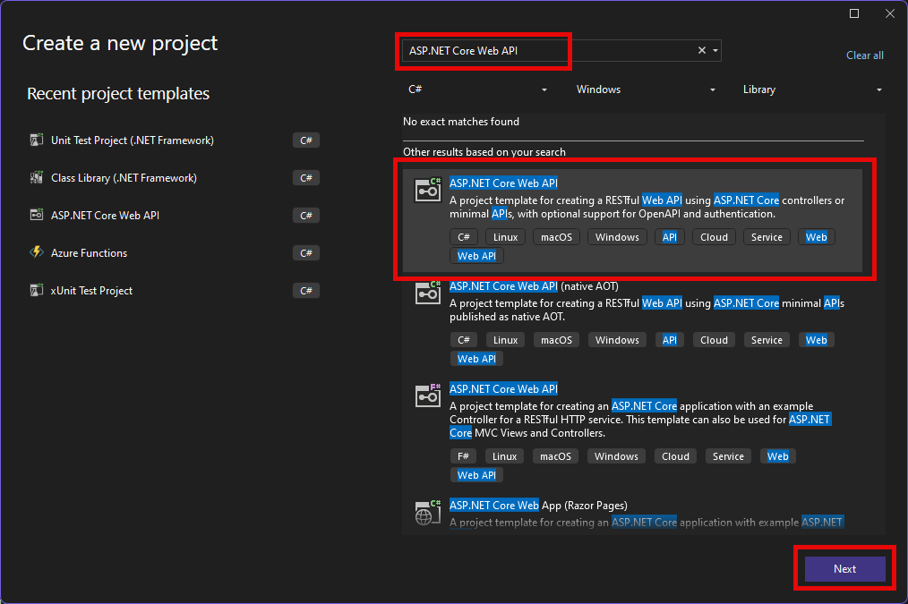

1. Enter `WeatherForecast` as the **Project name** ➡️ Select the `C:\workshop\` as the location of your project ➡️ Select **Next**.

1. Select **.NET 8.0** (Install SDK and latest version of Visual Studio 2022 if you do not see this option) , Set **Configure for HTTPS**, **Enable OpenAPI support**, and **Use controllers**➡️ **Create**.

1. Select **Tools** ➡️ **NuGet Package Manager** ➡️ **Manage NuGet Packages for solution**. 

1. In the NuGet window **Browse** tab, search for`Swashbuckle.AspNetcore.Annotations` ➡️ Select the `WeatherForecast` project ➡️ Select **Install** ➡️ Select **Apply** ➡️  **I Accept**.      
   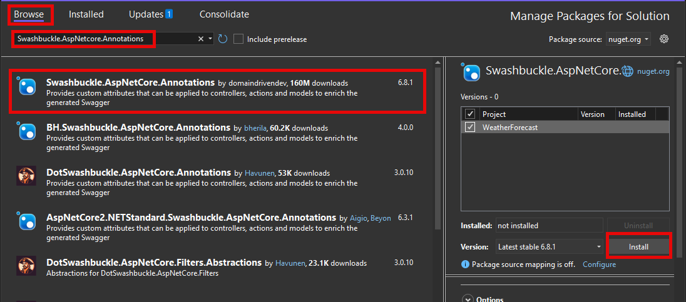

1. Next you must configure your project to use the version 2 swagger OpenAPI specification and provide an API title and version. Locate the following line in `Program.cs`:

   ```
   builder.Services.AddSwaggerGen();
   ```

   Replace with:

   ```
   builder.Services.AddSwaggerGen(c =>
   {
       c.SwaggerDoc("v1", new OpenApiInfo { Title = "WeatherForecast", Version = "v1" });
       c.EnableAnnotations();
   });
   ```

   

1. Still inside `Program.cs`, locate:

   ```
   app.UseSwagger();
   ```

   

   Replace with:

   ```
   app.UseSwagger(c =>
   {
       c.OpenApiVersion = Microsoft.OpenApi.OpenApiSpecVersion.OpenApi2_0;
   });
   ```

1. Update the `WeatherForecast.cs` to be:

   ```c#
   using Swashbuckle.AspNetCore.Annotations;
   
   namespace WeatherForecast
   {
       public class ForecastResponse
       {
           [SwaggerSchema(Description = "The weather forecast")]
           public WeatherForecast[] WeatherForecast { get; set; }
       }
   
       public class WeatherForecast
       {
           [SwaggerSchema(Format = "date", Description = "The date of the forecast")]
           public DateTime Date { get; set; }
   
           [SwaggerSchema(Description = "The temperature in Celsius")]
           public int TemperatureC { get; set; }
   
           //public int TemperatureF => 32 + (int)(TemperatureC / 0.5556);
           [SwaggerSchema(Description = "A summary of the weather conditions")]
           public string? Summary { get; set; }
       }
   }
   
   ```

   This is to enable Copilot Studio to interpret the data.

1. Now we can add a parameter and annotations to our service. Open the `Controllers/WeatherForecastController.cs`.

1. At the top of the file add:

      ```C#
      using Swashbuckle.AspNetCore.Annotations;
      using System.ComponentModel.DataAnnotations;
      ```

1. Update the Get function to be:

     ```c#
     d
     ```
     
1. **Save** all your edits.
> [!NOTE] 
> In your projects, you will want to implement security. You can find instructions on how to do this using [PowerPlatformAdvocates/Workshops/CustomConnectorInVisualStudio](https://github.com/microsoft/PowerPlatformAdvocates/tree/main/Workshops/CustomConnectorInVisualStudio)

## ✅ Task 2 : Publish Custom Connector into Power Platform

Visual Studio comes with built in support for Power Platform so that we can publish our API as a custom connector.

1. In the **Solution Explorer**, right click Connected Services ➡️ **Add** ➡️ **Microsoft Power Platform**.    
   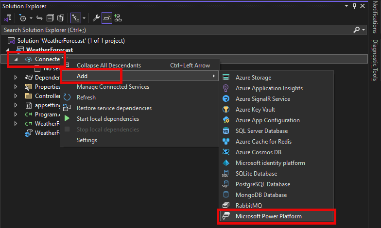

1. In the account selector on the top right, Select **add an account,** and add your Power Platform login.

1. You may need to close and restart Visual Studio at this point if you had already been connected to a different account.

1. Select your Power Platform developer environment, and the Power Platform Pro Developer Workshop solution.    
   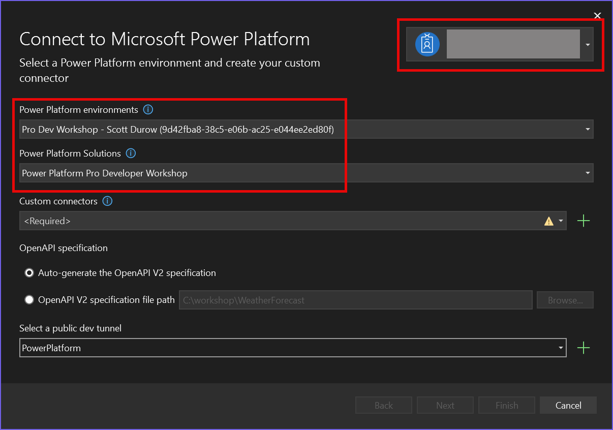

1. Select the **add + button** next to the **Custom connectors** -> **Create**.

1. Select the add + button next to Select a public dev tunnel, enter the name **Power Platform** and ensure the Access is set to **Public**. Select **OK**.    
   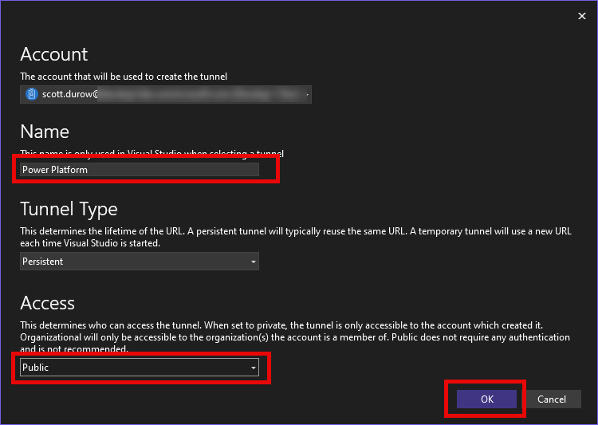

1. Select **Next** ➡️ **Finish**.

1. Once the connector has finished being created, we can open it in Power Platform. Inside **make.powerapps.com** -> Navigate to **Custom Connectors** or you can right click on the **Microsoft Power Platform Connected Services** and select **Open Power Apps**.
    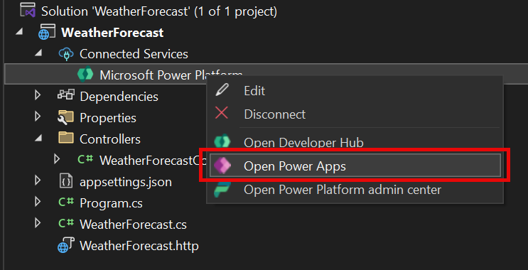

1. Select your `WeatherForecast_Connector` -> **Edit**.

1. Notice that the **Host** has the endpoint address of your **Dev Tunnel.**

1. Select Definition and review how your Web Api has been converted to a Custom Connector. This is because the swagger (Open API V2) has been imported.

1. You can toggle the Swagger editor and you will see the Swagger definition for your Web Api. This is the core of a custom connector.

1. Select **Test** -> + New Connection -> **Create**.

1. Return to your custom connector, and select **Test** once again.

1. Enter a **City** -> **Test operation**.

1. You will see the error `Operation failed (502), see response below`. This is because your project is not running and listening for requests on the other end of the dev tunnel.

1. Inside Visual Studio, Press `F5` to run the project. You will be asked to confirm that you want to use the Dev Tunnel. Select **Continue**.    
     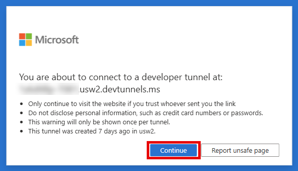

1. You will see your Web Api inside the Swagger UI. Select `WeatherForecast`. You can select the GET `WeatherForecast`  -> **Try it Out** -> Enter a city -> **Execute**. You will see a list of temperatures. 

1. Inside **Visual Studio,** you can set a break point in the `WeatherForecastController.Get` method, and test again. The breakpoint will be hit. You can then use `F5` to continue.    
     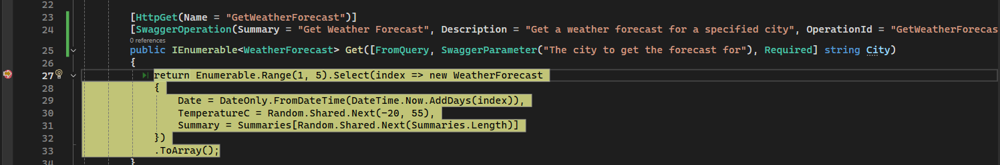

1. Now return to the custom connector and use **Test operation** again. You will see the breakpoint hit again, use `F5` to continue, and then see the response in the **Custom Connector Response Body**.     
    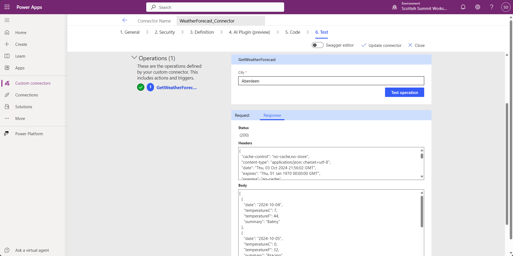

    This is useful for debugging since the Power Platform is now communicating directly to your local Visual Studio process.

## ✅ Task 4 : Add custom connector to Copilot Studio

Now that we have our custom connector working and the web api running inside Visual Studio, we can add this to Copilot Studio to give a natural language to our Web Api.

1. Inside the **Power Platform Pro Dev Summit Workshop** solution, select **New** -> **Agent**.

1. You can use Copilot to create an agent, but we will simply select **Skip to configure**.

1. Enter **Weather agent** as the name -> **Create**.

1. Select **Tools** -> **Add a tool**.

1. Select **...** -> **Connector**.

1. Enter `Get Weather Forecast` in the search, select the **Get Weather Forecast** connector. Make sure you select your custom connector.     

   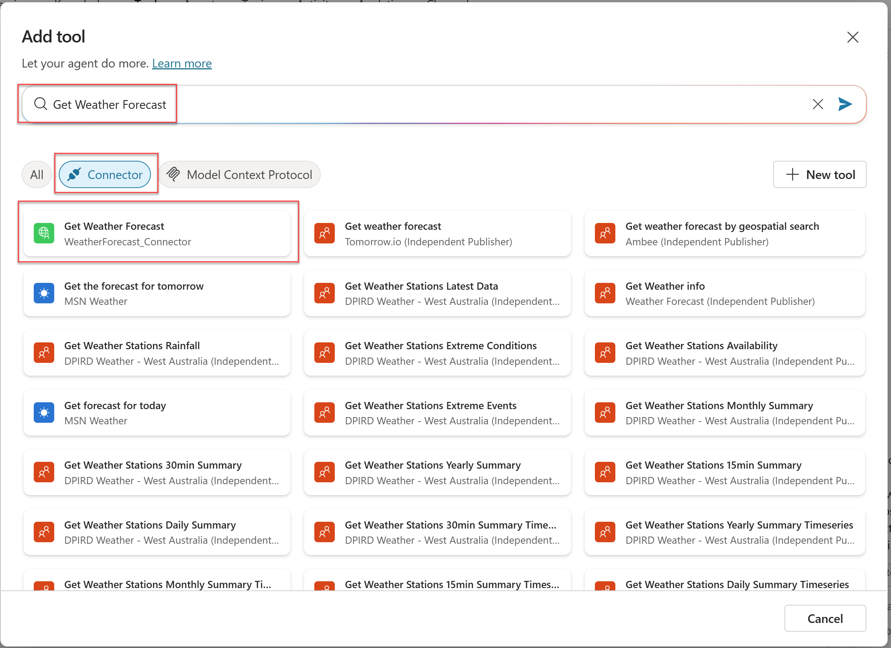

1. On the next page, Select **Add and configure**

1. On the **Next** page, select **Additional details** -> **Copilot author authentication** since we do not need the user to be authenticated. In your scenarios you may need the user to be authenticated with your Web API to ensure that they have access. See [PowerPlatformAdvocates/Workshops/CustomConnectorInVisualStudio](https://github.com/microsoft/PowerPlatformAdvocates/tree/main/Workshops/CustomConnectorInVisualStudio)    
   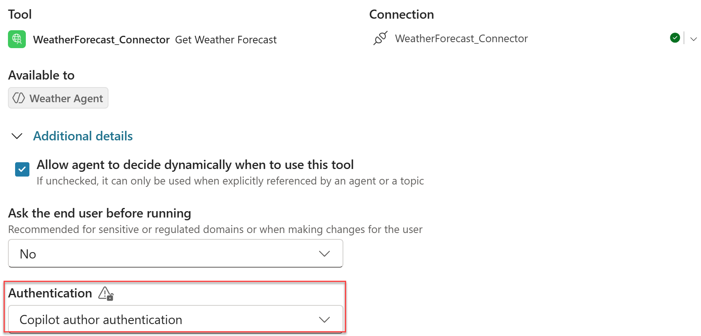

1. 

1. Expand **Completion -> Advanced -> Outputs**.

1. Select **Outputs** -> `weatherForecast` -> **Edit**.

    1. **Display name:** Weather Forecast

    1. **Description:** List of temperatures for the city by date   
       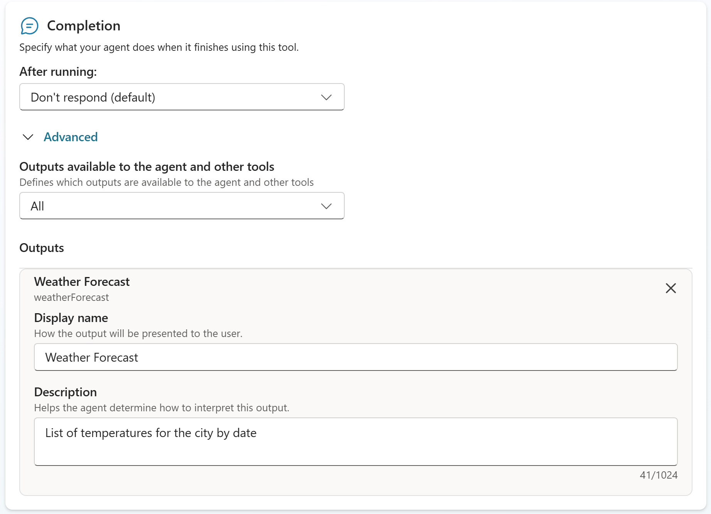

    1. Select **Save**

    1. Select **Settings** -> **Generative AI** -> **Use generative AI orchestration for your agent's responses?** -> **Yes**

    1. Select **Medium** as the moderation level.

    1. Select **Save** -> Close.

    1. Open Test by toggling the Test button, and in the test panel on the right, enter the query:

       > What is the weather forecast for Aberdeen?

    1. You will see the activity map show the call to your custom connector.  
       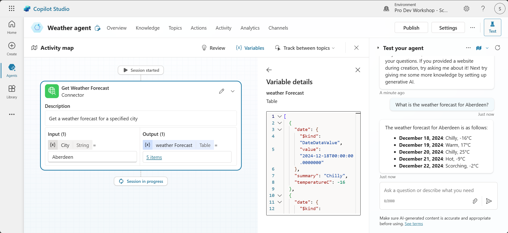

    1. You can also then ask refining questions and the agent will generate an answer from the connector response.    
       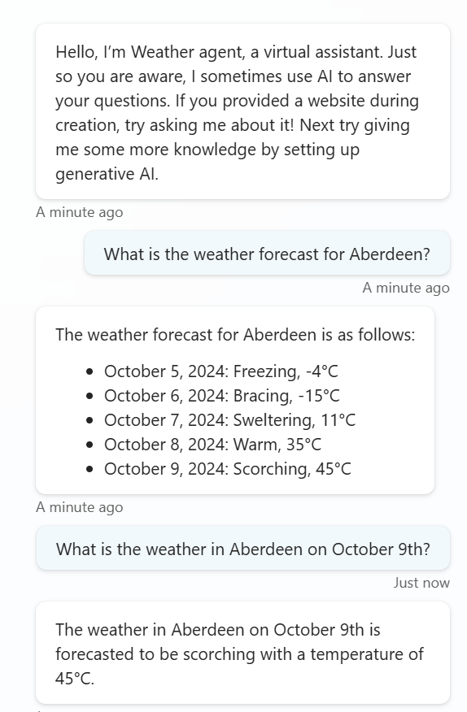

    1. Now **stop the debugging** session in Visual Studio, and **close** Visual Studio.

    ## 🥳Congratulations!

    Now that you have completed this lab you have learned how to create a Web Api written in C# and interact with it via a Power Platform Custom Connector inside Copilot Studio.

