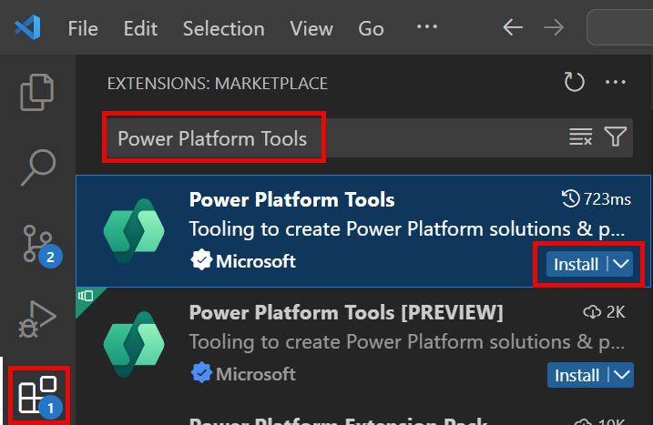

# Lab Prerequisites

These instructions guide you through setting up your developer workstation. They assume:

1. You are using a Microsoft Windows 11 workstation with Administrative rights to install programs.
1. You have access to a Power Platform tenant that is in the same directory as your Azure Subscription.

## ✅Install Visual Studio Community

1. Navigate to [Download Visual Studio Tools - Install Free for Windows, Mac, Linux (microsoft.com)](https://visualstudio.microsoft.com/downloads/) and select **Community** -> **Free Download**
1. **Open** the downloaded `VisualStudioSetup.exe` and follow the instructions.
1. On the **Workloads** tab, select:
   - ASP.NET and web development
   - Azure development
   - Data storage and processing
1. On the **Individual components** tab, ensure the following are selected and add if required:
   - .NET 8.0 Runtime (Long Term Support)
   - .NET 6.0 Runtime (Long Term Support)
   - .NET Aspire SDK 
   - .NET Framework 4.6.2 SDK
   - .NET Framework 4.6.2 targeting pack
   - .NET Framework 4.7.2 SDK
   - .NET Framework 4.7.2 targeting pack
   - .NET Framework 4.8 SDK
   - .NET Framework 4.8 targeting pack
   - .NET SDK
   - Windows 11 SDK (10.0.22621.0)
1. Select **Install**
1. Wait for the install to complete.
1. When prompted to Sign in to Visual Studio, sign in with your Microsoft account if you have one, or select **Skip this for now**
1. Choose your theme (dark is used in these instructions), and select Start.
1. Close the Visual Studio installer window.

> [!TIP]
> If you already have Visual Studio installed you can check the Workloads, and Individual components and add any missing by running the Visual Studio Installer from your start menu.

## ✅Install VSCode

1. Navigate to [Download Visual Studio Code - Mac, Linux, Windows](https://code.visualstudio.com/Download) and select **Windows**
1. Open the downloaded `VSCodeUserSetup-x64-...exe`
1. If you get the message "This User Installer is not meant to be run as an Administrator.", Select **OK**.
1. Select **I accept the agreement** -> **Next**.
1. Accept the default location -> **Next**.
1. Accept the default Start Menu name -> **Next**.
1. Select both of the **Add "Open with Code**" checkboxes -> **Next** -> **Install**.
1. Select **Finish** once completed
1. Open **VSCode** from the start menu.
1. Select your theme. **Dark Modern** is used for these instructions.

## ✅Install Git for windows

1. Navigate to [Git - Downloads (git-scm.com)](https://git-scm.com/downloads) and select **Windows**
1. Select **Click here to download** 
1. Open the downloaded **Git installer exe**.
1. Select **Next**.
1. Accept the default folder location -> **Next**.
1. Select **Add a Git Bash Profile to Windows Terminal** -> **Next**.
1. Accept the default start menu folder -> **Next**.
1. In the **dropdown** select **Use Visual Studio Code as Git's default editor** -> **Next**.
1. Leave the default **Let Git decide** -> **Next** .
1. Leave the default **Git from the command line and also from 3rd-party software** -> **Next**.
1. Leave the default **Use bundled OpenSSH** -> **Next**.
1. Leave the default **Use the OpenSSL Library** -> **Next**.
1. Leave the default **Checkout Windows-style, commit Unix-style line endings** -> **Next**.
1. Leave the default **Use MinTTY** -> **Next**.
1. Leave the default **Fast-forward or merge** -> **Next**.
1. Leave the default **Git Credential Manager** -> **Next**.
1. Leave the default **Enable file system caching** -> **Next**.
1. Leave **Enable experimental support for pseudo consoles** unchecked -> **Install**.
1. Select **Finish** once installed.

## ✅Install the Git CLI

1. Navigate to [GitHub CLI | Take GitHub to the command line](https://cli.github.com/)
1. Select **Download for Windows**
1. Open the downloaded `msi`.
1. Select **Next** -> **Next**-> **Install**.
1. Select **Finish** once installed.

## ✅Install Azure CLI

The Azure CLI (az) is used to perform operations on Azure. The official instructions on installing can be found at [Install the Azure CLI for Windows | Microsoft Learn](https://learn.microsoft.com/en-us/cli/azure/install-azure-cli-windows?tabs=winget)

1. Download the latest x64 installer from [Install the Azure CLI for Windows | Microsoft Learn](https://learn.microsoft.com/en-us/cli/azure/install-azure-cli-windows?tabs=azure-cli)
1. Run the downloaded installer.
1. Alternatively, you can open a terminal using `Windows Key + X` and select **Terminal (Admin)**
1. Then use the following command to install the Azure CLI

```pwoershell
 $ProgressPreference = 'SilentlyContinue'; Invoke-WebRequest -Uri https://aka.ms/installazurecliwindows -OutFile .\AzureCLI.msi; Start-Process msiexec.exe -Wait -ArgumentList '/I AzureCLI.msi /quiet'; Remove-Item .\AzureCLI.msi
```

> [!NOTE]
> The installation may take a few minutes.

## ✅Install Node

The TypeScript components require node to be installed so that they have access to the node run time and the node package manager (npm).

1. Navigate to [Node.js — Download Node.js® (nodejs.org)](https://nodejs.org/en/download/package-manager)
1. Select the **Prebuilt installer** tab and **Download Node.js**
1. Run the downloaded installer.
1. Select Next
1. Accept the agrement - > Next 
1. Accept the default file path -> Next
1. Accept the defaults -> Next
1. Check 'Automatically install the necessary tools'
1. Select Next -> Install
1. Select Finish
1. The **Install Additional Tools** dialog will popup, **press any key to continue**.
1. Various packages will be installed automatically.

## ✅Create a GitHub account

For this workshop, we are going to be using a **GitHub personal** account. If you already have a **GitHub personal** account, you can skip this task and simply login to GitHub.

1. Open [GitHub](https://github.com) in the browser session using the profile you created above.
1. Click on **Sign up** on the top right corner.
1. Enter your email address (Use a personal email address. Do not use your work address or the workshop account) and then click **Continue.**
1. Create a password and then click **Continue.**
1. Enter a username and then click **Continue**.
1. Select whether you want to receive product updates or not and then click **Continue.**
1. Solve the puzzle to verify your account and then click **Create account**.
1. Enter the code that was sent to your email address and then when you've navigated to the welcome screen, click **Skip personalization**.

You now have a GitHub account - ensure you are logged in as your GitHub account in the browser profile that you created earlier. 

## ✅Create a new browser profile (Microsoft Edge)

It's always good to have a separate browser profile for your work and for workshops like this. This way you can keep all of your credentials separate and not have to worry about logging out of your personal / work accounts.

1. Open **Microsoft Edge**.

1. Click on the profile icon (this may be on the top left or top right corner).  

1. It the bottom of the profile list, hover over **Other profiles** and then select **Set up new work profile**.  If there are no existing profiles, simply select **Add new account -> Sign in to sync data**.
   

> [!IMPORTANT]
> Select **Set up new work profile** not **Set up new personal profile**

4. Click **Add**.

   This will then open up a new browser window on your taskbar.

4. In the new browser window, select **Start without your data**.

4. Select either **Allow** or **Don't allow**, and then select **Confirm and start browsing**.

   Edge may prompt you to configure your new browser theme. If this happens, select System default, Light or Dark and select **Next**.

> [!NOTE]
> All the screenshots in these labs are using Dark mode.

7. Select **Finish**.

> [!IMPORTANT]
> Re-open these labs inside the new browser profile window so that any links will open in the correct profile.

## ✅Log in to Power Apps

Using the new browser profile,  log into to Power Apps.

1. In the new browser profile, navigate to [make.powerapps.com](https://make.powerapps.com)

> [!IMPORTANT]
> Make sure you use the new browser profile, instead of an existing profile.


2. Sign in if you are prompted to do so.

2. If you're prompted to stay signed in, check **Don't show this again**, and select **Yes**.

2. If asked to choose your region, select **United States** and select **Get started**.

   You should now be logged in and on the Power Apps Home Page.

## ✅Create a developer environment

For this workshop, you will need a Dataverse environment. You can create up to 3 of these for free. Developer environments will be deleted after a period of inactivity.

### 👉Subscribing to the developer plan

You are required to subscribe to the Power Apps Developer Plan to create developer environments that gives you access to all of the Power Platform resources for development purposes. 

To create developer environments, you can create them in multiple ways:

1. Subscribing to the Power Apps Developer Plan.
1. Using the Power Platform Admin Center (PPAC)
1. Using the Power Platform CLI

In this workshop we will use option 1 because it will automatically assign a developer license to yourself, where as the other options do not.

1. Go to the [Power Apps Developer Plan](https://aka.ms/pp/devplan) page (use the Edge profile you created for this workshop).
1. Select **Try for Free.**
1. Enter your username and check the **Agree** checkbox.- > Select **Start free**.
1. Leave the country as United States and select the **Accept** button.  
1. After selecting **Accept**, a Power Platform developer environment will be created for you with the name `[User Name]'s Environment`. You will then be redirected to the maker portal. 

### 👉Create developer environment

To create a developer environment for your lab:

1. Open the Power Platform admin center https://admin.powerplatform.microsoft.com/
1. Select **Environments** in the left hand menu
1. Select New, and enter `Developer Workshop (Scott)`
1. Choose **United States** as the region. 
1. Select **Developer** as the Type. 
1. Select **Next**
1. Select **English (United States)**, and **USD($)**.
1. Select **Save**.
1. Wait for the environment to show as **Ready**
1. Select the **environment**.
1. Select **Resources** -> **Dynamics 365 apps**.
1. Where **Update available** is shown, select the link.
1. Check **I agree to the terms of service**.
1. Select **Update**.
1. **Repeat** for all updates.
1. **Wait** until the updates are installed

## ✅Install Power Platform Tools VS Code extensions

The Power Platform Tools extension provides extensions to VS Code to interact with Power Platform.

1. Open **VS Code**.
1. Select the **Extensions** item from the **Activity Bar** on the left
1. Search for **Power Platform Tools** -> **Select Power Platform Tools** -> **Install**.     
   
1. Wait for the install to complete and then re-start **VS Code**.

### Authorize the PAC CLI

1. Run the following command at the new terminal in your Code Space:

   ```bash
   pac auth create --deviceCode
   ```

   > [!NOTE]
   > If you see an error then close any existing terminals and open a new one using ```Ctrl+Shift+` ```

1. Copy the https://microsoft.com/devicelogin link and paste it into the **browser profile window that you created earlier**. 

1. Copy the code, and paste it into the **Enter code** prompt and select **Next**.  

1. Select the Workshop User account that is Signed In. If you do not see it, then select **Use another account**, type in your workshop username and password, and click **Sign in**.

> [!NOTE]
> If you are using an environment other than your own developer environment, ensure you log in as an administrator on that environment when prompted. The privileges provided by these roles are needed to deploy any code components to Dataverse.

9. If you see a **Pick an account** screen, select your workshop user which should say *Signed In* next to it.

9. You will then see a page asking if you're trying to sign in to Power Platform CLI - pac.  

9. Click **Continue**
   You'll then see a prompt confirming that you have successfully signed in to Power Platform CLI - pac. Close the browser tab and return to your codespace.  

9. The Code space terminal should show the message **Authentication profile created** showing the workshop user you were provided.  

9. At the terminal type `pac auth list`. You will see the new auth profile with an asterisk (*) next to it indicating that it is the currently selected profile. The profiles is created as **UNIVERSAL** meaning that it is not specific to any specific environment.  

9. To select our developer environment, expand the Power Platform left panel. If you do not see the **UNIVERSAL** profile, hover over the AUTH PROFILES area and select **Refresh**.

   > [!IMPORTANT]
   > If you do not see the power platform extension logo as in the screenshot below, press `Ctrl + Shift + P`, and then type `Developer: Reload Window` and press `ENTER`.

9. To select our developer environment, use the Star icon **Select Environment**. The Environment then should have a filled star next to it.  

9. If you now run `pac auth list` you will see the URL of the environment you have selected listed. The asterisk (*) indicates that this is the currently selected auth profiles if you have multiple different profiles for different tenants. You can switch using `pac auth select --index`  

   > [!NOTE]
   > You can also select an environment by using
   > `pac org select --envrionment <URL/ID/Unique Name/Partial Name>`

9. To ensure that you are connected to the correct environment, at the terminal type `pac org who`
   This will show the current connection and environment selected.  

### 👉Import workshop solution and data

This workshop uses a solution as a starting point. We can import the solution and the sample data using the PAC (Power Platform CLI)

1. Inside VS Code, at the PowerShell terminal use:
   ```
   pac solution import --path "C:\WorkshopStarterSolution\PowerPlatformProDeveloperWorkshop_1_0_0_0.zip"  --async  --publish-changes
   ```

   Wait for the solution to import and publish.

1. Import the reference and sample data using:

```powershell
pac data import -d "C:\WorkshopStarterSolution\reference-data.zip"
pac data import -d "C:\WorkshopStarterSolution\sample-data.zip"
```

